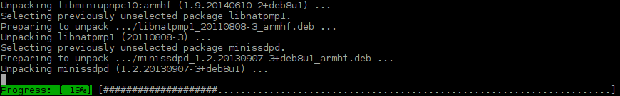

APT-like fancy progress bar
===========================
Do you like the progress bar that is being shown while `apt` package manager is installing? Does your console application echo a lot of information and you never know whether it is going to end soon or not? If so, you can enhance your application with this fancy progress bar:

How to Use
----------
In included demo application, you can see how simple is to use it. In fact, only thing you need are these three functions:
- `fancy_progress_start()` prepares screen for the progress bar,
- `fancy_progress_step()` renders actual progress and
- `fancy_progress_stop()` removes the bar when it is no longer needed.

License
-------
This software is licensed under MIT license.
